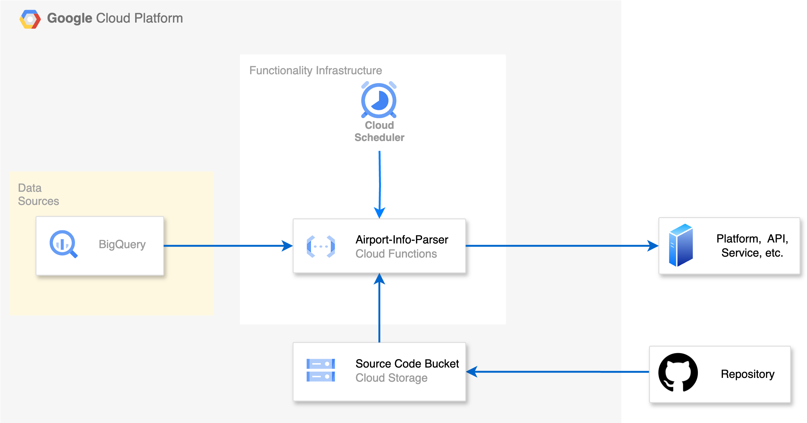

# Taller de Terraform: Desplegando una Cloud Function a GCP

## Visión General

Este repositorio contiene el código y los recursos para un taller enfocado en desplegar una Función en la Nube de Google Cloud Platform (GCP) utilizando Terraform. Los participantes aprenderán a utilizar Terraform para infraestructura como código y a desplegar una función serverless que interactúa con BigQuery.

## Requisitos Previos

Antes de comenzar, asegúrate de tener lo siguiente:

-   **Editor de Texto**: Puedes usar el editor de texto que prefieras, pero sugerimos utilizar Visual Studio Code.

-   **Instalación de Terraform**:

    -   **Instalando Terraform usando Homebrew**:

        1. Abre tu terminal.
        2. Si no tienes Homebrew instalado, puedes instalarlo ejecutando el siguiente comando:
            ```bash
            /bin/bash -c "$(curl -fsSL https://raw.githubusercontent.com/Homebrew/install/HEAD/install.sh)"
            ```
        3. Una vez que Homebrew esté instalado, puedes instalar Terraform con:
            ```bash
            brew tap hashicorp/tap
            brew install hashicorp/tap/terraform
            ```

    -   **Instalando Terraform sin Homebrew**:
        1. Descarga el último binario de Terraform desde la [página de descargas de Terraform](https://www.terraform.io/downloads.html).
        2. Descomprime el archivo descargado y mueve el binario `terraform` a un directorio incluido en tu `PATH`. Por ejemplo:
            ```bash
            sudo mv terraform /usr/local/bin/
            ```
        3. Verifica la instalación ejecutando:
            ```bash
            terraform -v
            ```

-   **Acceso a GCP**: Usaremos una cuenta de servicio para desplegar la arquitectura, pero tener acceso a la consola de GCP es un valor añadido.

## Clonar el Repositorio Localmente

Para clonar este repositorio en tu máquina local, sigue estos pasos:

1. **Abre tu Terminal o Símbolo del Sistema**: Usa la aplicación de Terminal que prefieras. También puedes usar la terminal de VSCode manteniendo presionado `Cmd + Shift + P` y escribiendo `Terminal: Create New Terminal`.

2. **Verifica la instalación de Git**: Asegúrate de tener Git instalado en tu computadora. Ejecuta el siguiente comando en la terminal. Si Git está instalado, verás el número de versión en la terminal.

    ```
     git -v
    ```

3. **Navega a tu Directorio Deseado**: Usa el comando `cd` para cambiar al directorio donde deseas clonar el repositorio. Por ejemplo:

    ```bash
    cd Documents/trainings/
    ```

    Si usas VSCode la terminal se despliega en la carpeta que abriste. Si esta es la carpeta que deseas usar no debes hacer mas nada.

4. **Clona el Repositorio:** Usa el comando `git clone` seguido de la URL del repositorio. Reemplaza `[GITHUB URL]` con la URL real del repositorio.

    ```
    git clone [GITHUB URL]
    ```

5. **Cambia al Directorio Clonado:** Después de clonar, navega al nuevo directorio creado con el siguiente comando:
    ```bash
    cd terraform-workshop
    ```
6. **Verifica el Clon:** Puedes verificar que el repositorio se ha clonado con éxito listando los archivos:
    ```bash
    ls
    ```
    Deberías ver el contenido del repositorio listado en tu terminal. ¡Ahora tienes una copia local del repositorio y puedes comenzar a trabajar en él!

## Detalles de la Función en la Nube

La función en la nube de este taller está construida con Node.js y utiliza la Biblioteca de Cliente de Node.js de BigQuery de GCP. Esta función está diseñada para acceder a una tabla pública de BigQuery, analizar la información relevante de cada registro y convertirla en un formato de cadena. La función se activa a través de solicitudes HTTP, lo que la hace accesible y fácil de integrar con otros servicios.

-   **Node.js**: [Sitio Oficial de Node.js](#)
-   **Biblioteca de Cliente de Node.js de BigQuery**: [Biblioteca de Cliente de BigQuery](#)

## Diagrama de Arquitectura



## Resumen de Branches

| Branch        | Descripción                                                                   | Comando en la Terminal     |
| ------------- | ----------------------------------------------------------------------------- | -------------------------- |
| `main`        | Una introducción al taller. Solo contiene el README.md y sus assets           | `git checkout main`        |
| `source-code` | Incluye el código fuente para la función en la nube que estaremos desplegando | `git checkout source-code` |
| `workshop-s1` | Contiene el código para la sección 1 del taller                               | `git checkout workshop-s1` |
| `workshop-s2` | Contiene el código para la sección 2 del taller                               | `git checkout workshop-s2` |
| `workshop-s3` | Contiene el código para la sección 3 del taller                               | `git checkout workshop-s3` |
| `workshop-s4` | Incluye el código final para el taller                                        | `git checkout workshop-s4` |

# ¿Qué es Terraform?

Terraform es una herramienta de software de infraestructura como código de código abierto creada por HashiCorp. Permite a los usuarios definir y aprovisionar la infraestructura de centros de datos utilizando un lenguaje de configuración declarativa conocido como HashiCorp Configuration Language (HCL). Con Terraform, puedes gestionar servicios en la nube, máquinas virtuales y otros componentes de infraestructura de manera eficiente.

[Aprende más sobre Terraform](https://www.terraform.io/)

[Documentación de Terraform](https://developer.hashicorp.com/terraform?product_intent=terraform)

## Registro de Terraform

Es un repositorio centralizado donde los usuarios pueden encontrar, compartir y utilizar módulos y proveedores de Terraform. Permite a los desarrolladores descubrir código de infraestructura reutilizable, facilitando la gestión y el aprovisionamiento de recursos a través de varios proveedores y servicios en la nube. El registro incluye tanto módulos oficiales proporcionados por HashiCorp como módulos contribuidos por la comunidad, promoviendo la colaboración y las mejores prácticas en infraestructura como código.

[Registro de Terraform de Google Cloud Platform](https://registry.terraform.io/providers/hashicorp/google/latest/docs)

## Recursos Adicionales

-   [Presentación del Taller](#)
-   [Guía de Instalación de Terraform](#)
-   [Registro de Terraform GCP](#)
-   ["Entendiendo Terraform: Una Guía para Principiantes" por John Doe](#)
-   ["Entendiendo Terraform: Una Guía para Principiantes" por John Doe](#)
-   ["Entendiendo Terraform: Una Guía para Principiantes" por John Doe](#)

Sentite libre de explorar el repositorio, seguir las instrucciones en el README y contactarnos con cualquier pregunta durante el taller!
